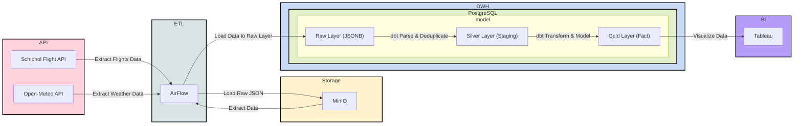
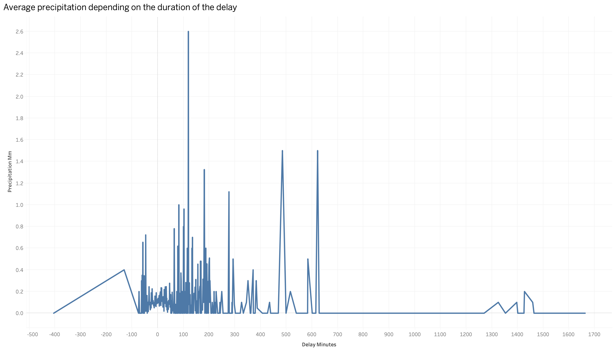

# Schiphol Flights & Weather ELT Pipeline

## Project Overview & Business Value
This project is an end-to-end, idempotent ELT (Extract, Load, Transform) data pipeline designed to analyze the impact of meteorological conditions on flight delays at Amsterdam Airport Schiphol

Instead of a traditional ETL approach, this pipeline leverages a modern ELT architecture. It extracts raw data from external APIs, lands it into an S3-compatible Data Lake, and utilizes a Data Warehouse for robust, incremental transformations and data quality testing 

The ultimate business goal is to provide data analysts with a clean,Data Mart, denormalized fact table ready for BI tools. This will help data analysts quickly and easily analyze ready-made data for clean analytics

## Stack
Every tool in this stack was deliberately chosen to mimic a production-grade enterprise environment:

* **Containerization:** **Docker** The entire infrastructure is fully containerized to ensure environment parity and "one-click" deployment
* **Orchestration:** **Apache Airflow** Used for scheduling DAGs, managing task dependencies, and executing Python callables via native operators
* **Data Lake (Bronze Layer):** **MinIO** An S3-compatible object storage used as a landing zone for raw JSON responses, ensuring an immutable historical archive of the API data
* **Data Warehouse (Silver & Gold Layers):** **PostgreSQL** Chosen for its powerful `JSONB` support, allowing us to load semi-structured data directly into the database before applying complex relational transformations
* **Transformation & Data Governance:** **dbt** Used to modularize SQL queries, build the Medallion architecture (Bronze -> Silver -> Gold), and enforce rigorous Data QA tests
* **Languages & APIs:** Python 3.11+, PostgreSQL, Schiphol Public API, Open-Meteo Archive API

## The Data Journey
The pipeline is structured according to the Medallion architecture, ensuring clear data lineage and incremental refinement:

### 1. Bronze Layer (Extract & Load)
* **API Integration:** Airflow DAGs execute Python tasks to pull data from **Schiphol Public API** (flights) and **Open-Meteo API** (weather)
* **Landing Zone:** Raw JSON responses are saved to MinIO using date-based partitioning for efficient storage and retrieval
* **ELT Pattern:** Using Airflow's native `S3Hook` and `PostgresHook`, the raw files are loaded directly into PostgreSQL as `JSONB` blobs. This preserves the original payload and allows for "schema-on-read" flexibility

### 2. Silver Layer (Staging & Cleansing)
* **JSON Flattening:** dbt models transform semi-structured `JSONB` into clean, strongly-typed relational tables
* **Robust Deduplication:** A window function (`ROW_NUMBER()`) is applied to handle API pagination overlaps and codeshare duplicates, ensuring a unique record for every flight based on the latest extraction
* **Advanced SQL Parsing:** Weather metrics (temperature, wind, precipitation) are unnested in parallel from columnar JSON arrays using PostgreSQL's `WITH ORDINALITY` to maintain exact index synchronization

### 3. Gold Layer (Analytics / Semantic Layer)
* **Business-Logic Joins:** The `fct_flights_weather` fact table joins flight records with weather conditions by rounding actual landing times to the nearest hour
* **Feature Engineering:** * `delay_minutes`: Calculated as the precise delta between scheduled and actual arrival
    * `is_foggy`: A boolean flag derived from WMO weather codes (45, 48) to highlight low-visibility conditions
    * `is_delayed`: A categorical flag for flights delayed beyond the 15-minute industry standard

## Advanced Engineering Features

### Incremental Data Processing
To optimize compute costs and performance, the dbt models (`stg_flights`, `stg_weather`, and `fct_flights_weather`) are implemented using an **incremental materialization** strategy
* Instead of rebuilding the entire warehouse daily, the pipeline uses the `` macro to process only the new records from the latest Airflow run
* This architecture ensures the system can scale to handle years of historical data without linear increases in processing time

### Secure Orchestration & Hook Pattern
The project strictly follows security best practices for data orchestration:
* **Decoupled Secrets:** No hardcoded credentials. Connections are managed via Airflow's native metadata database and injected through environment variables
* **Native Hooks:** The pipeline uses `S3Hook` and `PostgresHook` for all I/O operations. This allows Airflow to manage connection pooling, retries, and logging centrally, making the system more resilient than basic Python scripts

### Data Quality Assurance (Data QA)
Reliability is enforced through a multi-layered testing framework:
* **Schema Tests:** Automated `not_null` and `unique` constraints ensure the integrity of primary keys and critical business metrics
* **Custom Singular Tests:** I developed a custom SQL test (`assert_delay_minutes_logical_bounds.sql`) to validate business logic. This test ensures that flight delays stay within realistic mathematical boundaries (e.g., preventing API anomalies where delays might exceed 24 hours)
* **Test Coverage:** All transformations must pass 7+ data quality checks before the Gold layer is updated

## Analytics & BI Ready
The final output is a clean, denormalized semantic layer optimized for BI tools. Analysts can connect directly to the PostgreSQL Gold schema to visualize:

